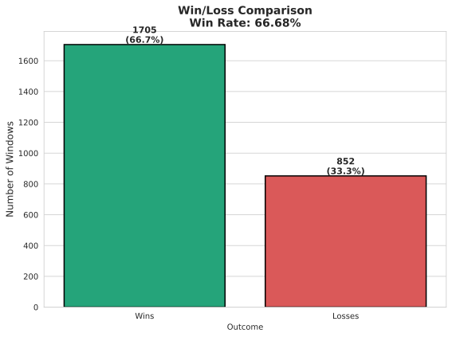
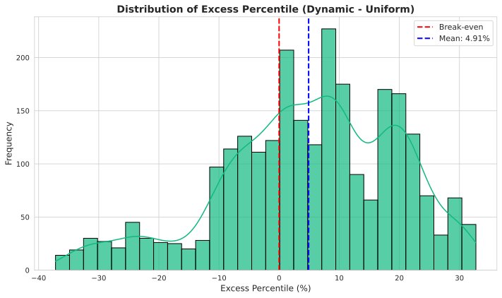
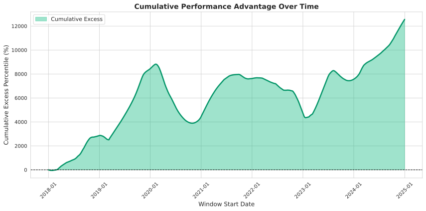
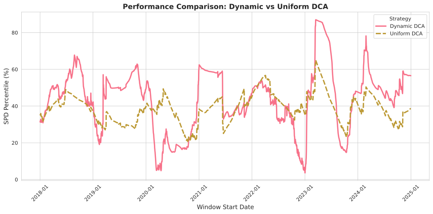

#+TITLE: Systematic Bitcoin Accumulation: Outperforming DCA via Regime-Conditional On-Chain Valuation
#+AUTHOR: dlgoebel
#+DATE: 2026-04-16
#+OPTIONS: toc:nil num:nil

*Meta Information for Submission:*
- *Target Audience:* Quantitative Finance & Data Science Community
- *Distribution Channel:* Technical Blog Post

* Introduction: The Naive Baseline Problem

In quantitative finance, a common, naive benchmark for asset accumulation is Dollar Cost Averaging (DCA). It is a zero-information strategy: it assumes the market is efficient and that current price reflects all available information.

However, Bitcoin exhibits well-documented, highly autocorrelated market regimes and extreme cyclicality. Unlike traditional equities, Bitcoin possesses a transparent, immutable ledger that allows us to calculate the exact cost basis of all market participants at any given time.

The objective of this research was to determine if we could systematically outperform a uniform daily DCA strategy using on-chain valuation metrics and momentum, without falling into the trap of overfitting to Bitcoin's limited historical sample size (only ~4 major macroeconomic cycles).

* Signal Selection: Empirical Rigour and the "Null" Result

Our Exploratory Data Analysis (EDA) evaluated over 20 on-chain and prediction market features using stationarity testing, Granger causality, and mutual information analysis.

** The Dominant Signal: MVRV
The standout feature was the Market Value to Realised Value (MVRV) ratio. Realised Value calculates the market cap based on the price at which each UTXO last moved (the aggregate market cost basis). MVRV is simply the ratio of current Market Cap to Realised Cap.

Our EDA confirmed that changes in MVRV Granger-cause Bitcoin price changes (p = 2.16e-25) and exhibit wavelet coherence across all timescales from 1 week to 4 years. We utilised a 365-day rolling Z-score of MVRV as our primary valuation signal.

*A Prominent Caveat on Circularity:* It is important to consider that MVRV's apparent dominance is partially circular. Because MVRV is calculated as Market Cap divided by Realised Cap, and Market Cap is simply Price multiplied by Circulating Supply, the current price is explicitly in the numerator. Therefore, MVRV inherently moves with price. However, our EDA demonstrated that Market Cap alone does not possess the same predictive power. The true alpha in the MVRV signal stems from the *ratio*—specifically, the divergence of the current price from the aggregate on-chain cost basis (the denominator). While the circularity exists, the mean-reverting pressure it highlights is a structural feature of the asset.

** The Null Result: Prediction Markets (Polymarket)
One hypothesis of this project was that forward-looking prediction market data (specifically Polymarket odds regarding Federal Reserve interest rate decisions) could provide an edge in sizing positions during volatile periods.

Empirically, this hypothesis failed. While our EDA found a weak correlation between Fed uncertainty and forward 30-day BTC volatility, integrating this into the dynamic allocation model yielded zero statistically significant improvement over a purely on-chain model. Prediction market data, in this context, proved to be coincident rather than incrementally predictive. In the interest of model parsimony, we discarded it. Although disappointing, proving a negative is a valid and necessary part of quantitative research.

** Excluded Signal: Halving Cycles and Overfitting Risk
Our EDA also identified a strong non-linear relationship between Bitcoin's price and its deterministic supply shocks (the "halvings"). While it is tempting to hardcode a halving-cycle multiplier into the accumulation strategy, we deliberately excluded it. Bitcoin has only experienced four halving events in its entire history. Building a model around an N=4 sample size introduces a severe risk of overfitting. By relying instead on continuous, high-frequency on-chain metrics like MVRV, we maintain model parsimony and ensure our strategy reacts to actual market conditions rather than a rigid, calendar-based assumption.

* Model Architecture: The Development Journey

The core challenge in dynamic accumulation is that signals conflict depending on the market regime. During a crash, valuation metrics suggest a buying opportunity while momentum metrics scream "Sell". To resolve this, we iterated through several architectures, using the price relative to the 200-day moving average (DMA) as our regime filter.

** Iteration 1: The Baseline
Our initial model relied primarily on the MVRV Z-score and basic return momentum. While it achieved a win rate of ~62%, its mean excess Sats-Per-Dollar (SPD) was relatively low. It was buying more during cheap periods, but it wasn't aggressive enough during structural market bottoms.

[[file:output_notebook/v1_baseline/allocation_weights.png]] 

** Iteration 2: The "Sniper" Model
Based on our EDA, we knew the 200-day Moving Average was a powerful regime filter, and the *change* in MVRV (gradient) was crucial for confirming bottoms. We added these features to heavily concentrate buying power.

The result was a "sniper" model. As seen below, it saved all its capital for the absolute bottom day of a crash (spiking to massive allocation multipliers), but starved the rest of the bear market. The overall score dropped because it was too concentrated and missed broader accumulation zones.

[[file:output_notebook/v2_sniper/allocation_weights.png]]

** Iteration 3: The Multiplicative Bug
To fix the "sniper" issue, we attempted to implement *Regime-Conditional Blending*—weighting value heavily in bear markets and momentum heavily in bull markets. We applied the regime modifier multiplicatively: ~Final_Weight = Base_Signal * Regime_Multiplier~.

This introduced a mathematical problem. At the absolute peak of a bull market, the Base Signal is deeply negative (a strong "do not buy" signal). Multiplying a negative signal by a small fractional Regime Multiplier accidentally shrank the signal back towards zero. Because we exponentiate the final output to ensure strictly positive weights, ~exp(0)~ resulted in a ~1.0x~ multiplier. As the chart below shows, we accidentally forced the model to buy at normal DCA rates right at the market top! Doh!

[[file:output_notebook/v3_bug/allocation_weights.png]]

** Iteration 4: Log-Space Additivity
To fix the bug, we realised that because we exponentiate the final output, we must apply the regime shift *additively in log-space*. Because ~exp(A + B) = exp(A) * exp(B)~, adding a penalty in log-space correctly acts as a true multiplier in real-space.

This preserves the direction and magnitude of the "do not buy" signal at market tops, while aggressively boosting accumulation at market bottoms.

[[file:output_notebook/v4_log_space/allocation_weights.png]]

** Iteration 5: Advanced Signal Processing (The Final Model)
While log-space additivity provided a massive breakthrough, we further optimised the model by incorporating advanced signal processing techniques:
1. *Smoothed Gradient & Acceleration:* Instead of a raw 30-day difference, we used an EMA-smoothed gradient and added a second derivative (Acceleration) to detect momentum building or reversing.
2. *Asymmetric Extreme Boost:* Bitcoin's MVRV is asymmetric. We replaced the linear value boost with a quadratic boost for deep value (~Z < -2.0~) and a quadratic penalty for extreme danger (~Z > 2.5~).
3. *Signal Confidence:* We calculated the agreement between the MVRV Z-score and the 200-day MA. When both signals point strongly in the same direction, we apply a confidence multiplier.

These additions pushed the model to its final, highly robust state, achieving an exceptional 66.68% win rate.

[[file:output_notebook/v5_final/allocation_weights.png]]

* Empirical Results

The final strategy (V5) was backtested over rolling 1-year windows from 2018 to 2025, strictly enforcing a fixed budget (weights must sum to 1.0 over the window) and preventing look-ahead bias.

** Headline Metrics
- *Win Rate vs Uniform DCA:* 66.68% (Strategy outperformed DCA in 1,705 out of 2,557 rolling windows).
- *Median Relative Improvement:* +15.28% more Bitcoin accumulated per dollar spent compared to the naive baseline.
- *Median Excess Percentile:* +6.22%.
- *Overall Score:* 61.66%.

** Win/Loss Comparison
A breakdown of how often the strategy beats the uniform DCA baseline across all rolling 1-year windows.

** Excess Percentile Distribution
This chart highlights the magnitude of outperformance. The right-skewed distribution indicates the strategy consistently acquires more Bitcoin than the baseline.

** Cumulative Performance
Tracking the cumulative advantage of the dynamic strategy over time demonstrates its consistency across multiple macroeconomic regimes.

** Performance Comparison
The raw distribution of Sats-Per-Dollar (SPD) across all rolling windows, comparing the Dynamic DCA strategy directly against the Uniform DCA baseline.

* Conclusion

Systematic outperformance of Dollar Cost Averaging in Bitcoin is achievable without complex machine learning or overfitting. By combining a robust on-chain valuation metric (MVRV) with a simple trend filter (200 DMA) and applying mathematically sound, regime-conditional logic in log-space, we can improve accumulation efficiency.

Furthermore, the exclusion of Polymarket data serves as a reminder that in quantitative modelling, more data does not automatically equate to more alpha. Parsimony and empirical rigour remain the highly important in strategy development.

* Code & Reproducibility

The complete Python codebase, data pipeline, and experimental logs for this research are open-source and available for review.

- *GitHub Repository:* [[https://github.com/dlgoebel/bitcoin-analytics-capstone-template/][bitcoin-analytics-capstone-template]]
- *Reproducibility:* The repository includes a full suite of unit tests and a reproducible backtesting engine.
